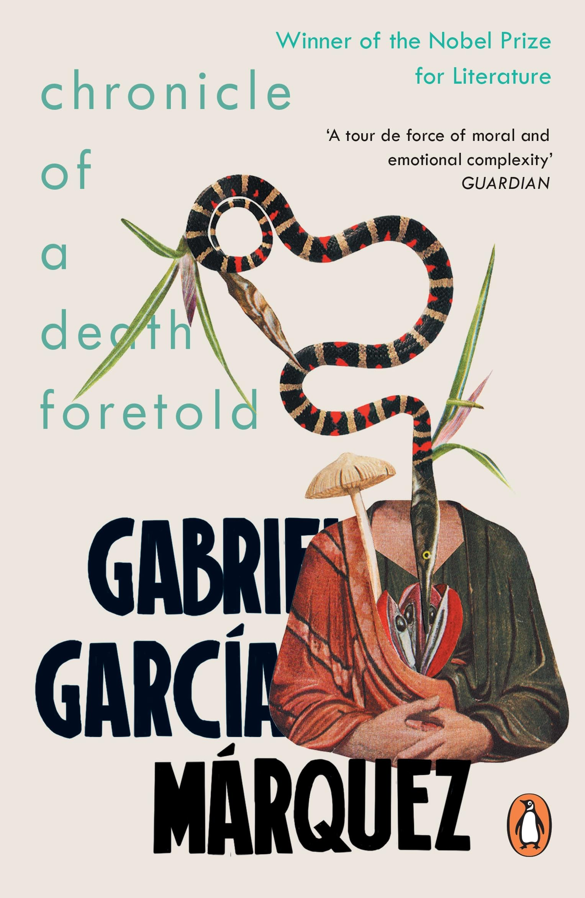

+++
author = "misfitMojo"
title = "Book Review - Chronicle of a Death Foretold"
date = "2022-05-06"
description = "A review of Gabriel Garcia Marquez's gripping tale of murder and fate"
categories = [
    "Book Reviews"
]
image = "deathForetold.jpg"
+++

This was a fairly short book that I read through in one sitting on a lazy holiday morning. The gripping storytelling and the layered non-linear plot that flitted across time and characters kept me hooked. The author Gabriel Garcia Marquez is known for pioneering a style of literature known as magic realism, blending fantasy and the ordinary. Also a popular journalist, he brings a journalistic touch to this complex tale of murder.

The story follows the unnamed author trying to understand the events behind a murder that shook his village almost 27 years ago. The victim Santiago Nasar, was a childhood friend of the author. He was hacked to death on the doorsteps of his home. The murderers were known to everyone and to the victim himself. They'd been going around the village announcing that they were going to murder Santiago. This was mistaken for the drunken rambling of young men who had been revelling too long. A wedding party unlike any the village had seen had taken place over the weekend. A wedding which in fact acts as a catalyst for Santiago's murder. The would-be murderers too do not want to commit the murder and were looking for someone to stop them. The whole village knew of the murder that was about to take place, and yet Santiago's fate had been sealed.

We are taken through recollections made by the characters who are still alive all those years later. They recite their memories of that fateful day, of how each had crossed paths with Santiago Nasar. He almost flows past them to his death. Many of them have lived and some have died, consumed by the regret that they could have prevented the senseless tragedy.

The senseless nature of events that lead to murder could be dismissed as being too convenient in any other novel. Gabriel Marquez's beautiful writing paints a picture that is magical and poignant, yet so ordinary and mundane. These are people going about their lives, with their own petty grievances and feuds, weaving their own intricate inner stories. The series of chance events that come together and lead to the murder leaves us pondering the random nature of our own lives.

Indeed this story is about so much more, mine has been a very reductive telling of the plot. One that does not even mention many of the major players in this drama. I would suggest you read the book to enjoy the themes, the personalities, their motivations and the tragedies that befall them.

What interested me the most, was what the story says about the contingent nature of our lives. Almost always on a razor's edge, never certain where we might fall. While it's an impossible task to map the true impact of what we do. Our actions, the small decisions we make every day, might not end up aiding a murder. And hopefully, unlike the people of this village, we won't have to live decades with the maddening weight of our actions or inaction. With the weight of the knowledge that our actions could have saved the life of a man whose death was foretold.