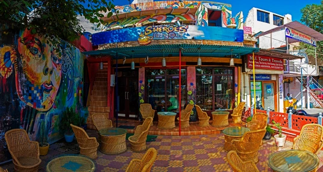

+++
author = "misfitMojo"
title = "Sheroes Hangout"
date = "2019-08-15"
description = "A heartwarming encounter at a unique cafe in Agra run by acid-attack survivors"
categories = [
    "Travel",
    "Social Impact"
]
image = "sheroes.jpg"
+++

**This was written sometime in 2015 after a tour from my college to Agra among other places in Northern India**

Hunger. We've been walking for a long time. We'd set out to find something that was a local specialty. Hunger. Maybe that was a bad idea. Maybe we should have just eaten at the South Indian restaurant the others had found. But being the free spirits we were, we had to find a dhaba(this was also due to the condition of our finances) . Hunger. And so now we roam the streets of Agra looking for a good dhaba. There was supposed to be a good one along this street ,or that's what Google told us. Hunger. We're at our limits, maybe we should eat at the next restaurant we see. 'Sheroes Hangout' , the tiny colorful board read. What's that supposed to mean? They have our attention. We take a peek into the shop. Seems like a cool place, must be expensive. We say among ourselves. There's even a library with quite a collection by one of the walls. We'll just pop in and check out the menu and prices, we decide. The menu is pretty standard, decent stuff, but they seem to have left out the prices. Aha! Trying to con us are you. We're too old to fall for that. We look around trying to find someone who looks like they're in charge there. We find a boy, who looks like he certainly isn't in charge. We ask him. He gives us a beaming smile and points out to the bottom of the menu card. Printed there in bold letters – "Pay as you wish."

Sheroes Hangout is the work of 5 women. 5 women who were victims of a cruel society. Their lives were destroyed by men who threw acid on their faces, scarring them for life. Their lives would have played out like the lives of thousands of other acid-attack survivors in India. But these women chose to fight back, they chose to reclaim their lives. Sheroes is an organization that provides support to acid-attack survivors and spreads awareness about this heinous crime. The cafe provides these women a livelihood and a chance to pursue their dreams. Here , they sell handicrafts and clothes designed by the women and others like them. The kitchen and the waiting staff is also entirely comprised of these women. Organizations like these go a long way in raising awareness on critical issues and changing perceptions.

After ordering and eating our fill, of the food which was excellent, at the cafe. We finally paid more than what our meals would have cost at any other place. The satisfaction of contributing to a noble cause, was many times more filling than the food itself.